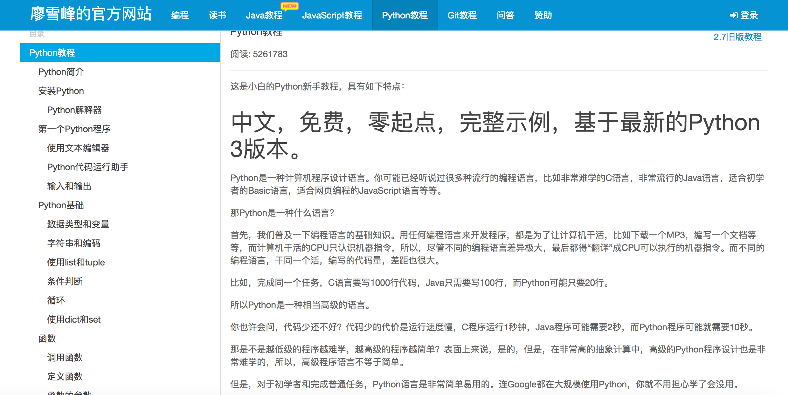
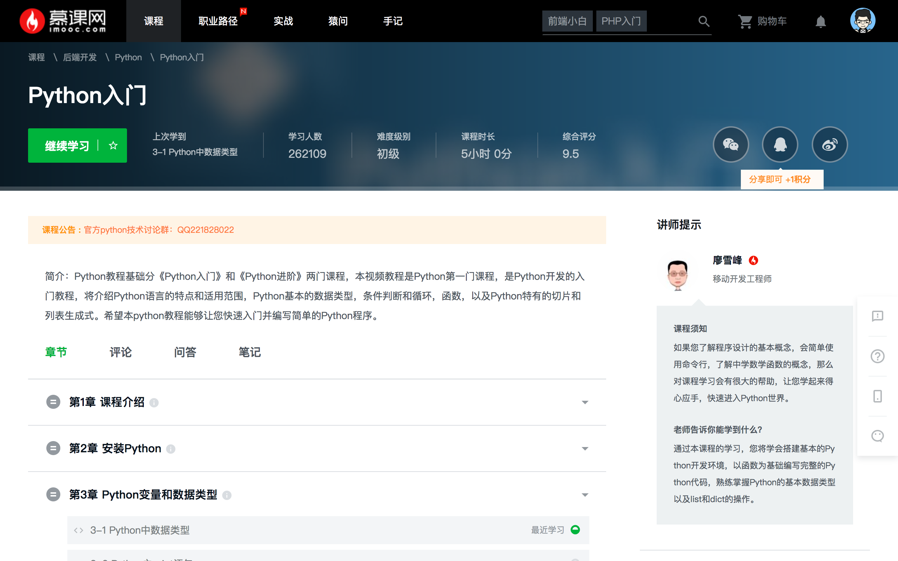
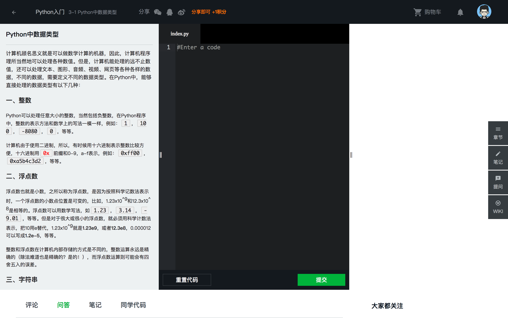
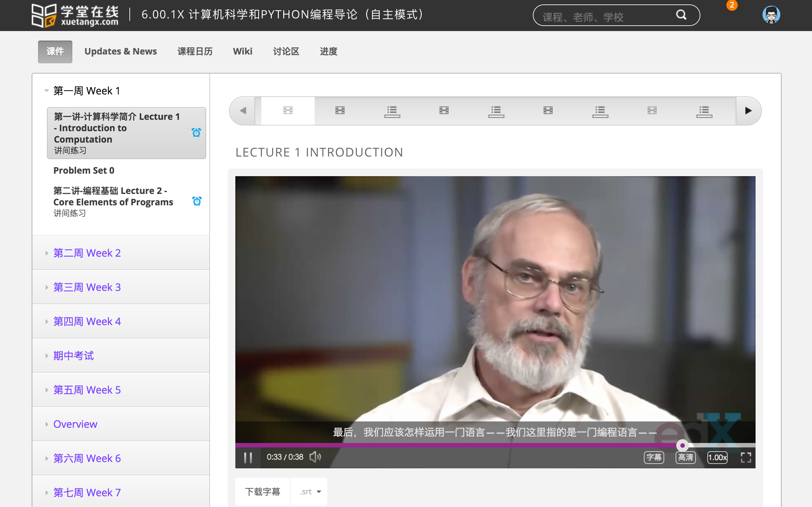
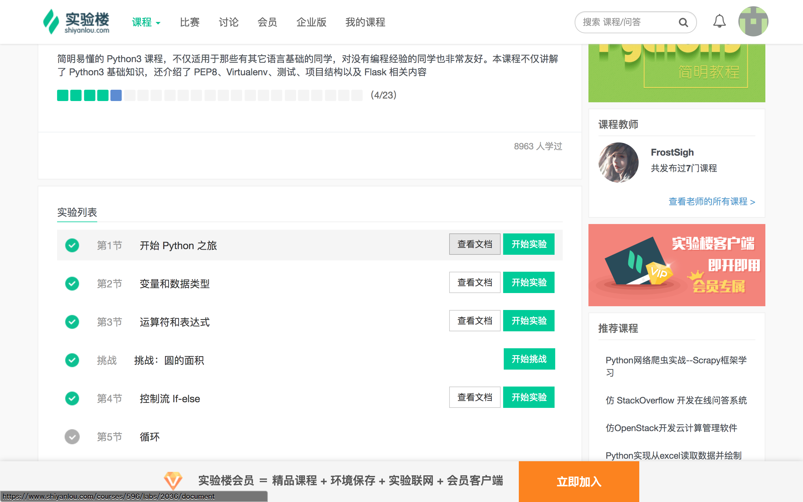
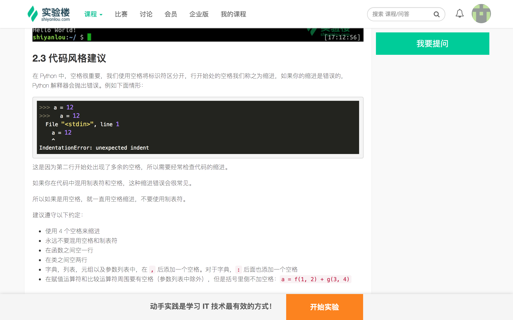
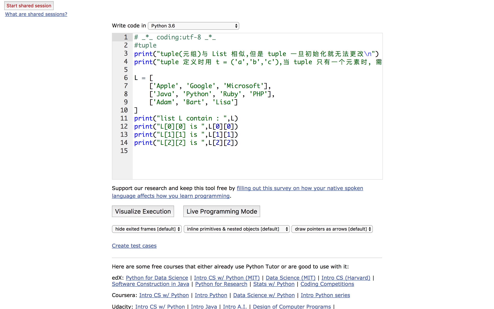
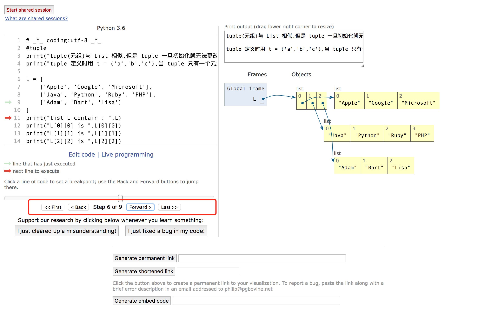

#学习资料

##廖雪峰Python教程
首先基础部分建议大家统一去看 廖雪峰Python教程文字版  

[廖雪峰Python教程链接](http://www.liaoxuefeng.com/wiki/0014316089557264a6b348958f449949df42a6d3a2e542c000)   

  
​    

除了他自己网站那个经典的教程，廖雪峰在慕课网也有一套python教程，附带视频（很少，基本都是文档），内容和他自己网站的差不多,大家视情况选择  
[廖雪峰慕课网教程链接](http://www.imooc.com/learn/177)

   

  

##  

##麻省理工学院 计算机科学和Python编程导论

学堂在线的一个python课程，与其说是python课程，其实是用python语言来教导如何编程，有大量的算法知识，学有余力着可以看看，然后来分享一些心得和收获 

[计算机科学和Python编程导论](http://www.xuetangx.com/courses/course-v1:MITx+6_00_1x+sp/about)  

##网盘视频资源  

[https://pan.baidu.com/s/1i5gKNeX](https://pan.baidu.com/s/1i5gKNeX)  提取码：xsaj   

孙想提供 [http://pan.baidu.com/s/1pLG00OF](http://pan.baidu.com/s/1pLG00OF) 提取码：ocjl    

胖若提供 [https://pan.baidu.com/s/1qYwLzqO#list/path=%2F](https://pan.baidu.com/s/1qYwLzqO#list/path=%2F)

##实验楼

点下面链接，可以选择查看文档跟着里面内容在电脑上敲一遍，当然也可以直接在网站里面开始试验（建议在自己电脑上完成）  
[https://www.shiyanlou.com/courses/596](https://www.shiyanlou.com/courses/596)
  

  

##pythontutor  

一个类似debug方式观察python代码执行的网站，前期可用来帮助理解集合字典等相关的存储概念  
[http://www.pythontutor.com/visualize.html#mode=edit](http://www.pythontutor.com/visualize.html#mode=edit)

#####举个例子：  
我从谭健康的代码中沾了一份代码，复制进去，然后点下面的 **visualize execution**
   
然后根据红框中的单步操作，观察右侧，来理解程序的执行

