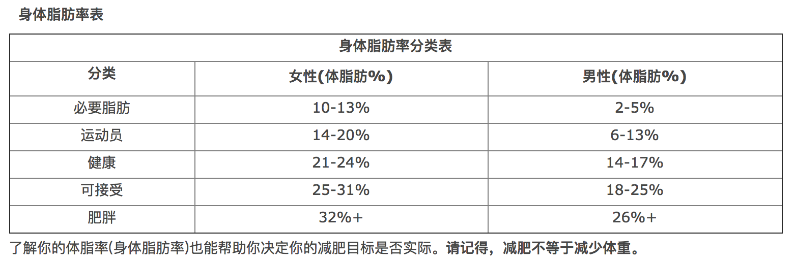

## Task 1
1. 完成廖雪峰教程中的 **输出和输出** **数据类型和变量** 部分
2. 跟着敲一遍上面教程中的代码，并提交
3. 完成下面一道编程题，算算自己是不是胖子  

### Programming Assignment 1 : 计算体脂率（BFR）
体脂率是指人体内脂肪重量在人体总体重中所占的比例，又称体脂百分数，它反映人体内脂肪含量的多少。测量体脂率需要养成良好的习惯，即使是使用设备来量测。测量的最佳时间是早晨。正好在你从充足的睡眠(7-8个小时)醒来之后，此时你的体重和腰围等的测量数据是最准确的。体脂率的计算公式很多，这里提供一个神体脂肪计算公式，可以很方便的计算出个人的体脂肪重量及比率或肌肉的增减数量，准确度也很高。 

**女性的身体脂肪公式 (cm 和 kg 是单位)**  

* a = 腰围（cm） x 0.74
* b = 总体重（kg） x 0.082 + 34.89
* 身体脂肪总重量（kg） = a - b
* 体脂率(身体脂肪百分比）= (身体脂肪总重量 ÷ 体重) x 100%

**男性的身体脂肪公式**  

* a = 腰围（cm） x 0.74
* b = 体重（kg） x 0.082 + 44.74
* 身体脂肪总重量(kg)= a - b
* 体脂率(身体脂肪百分比) = (身体脂肪总重量 ÷ 体重) x 100%
  
  

### 程序要求: 
输入 性别、腰围、和体重，输出体脂比，顺便给出相应的友好提示